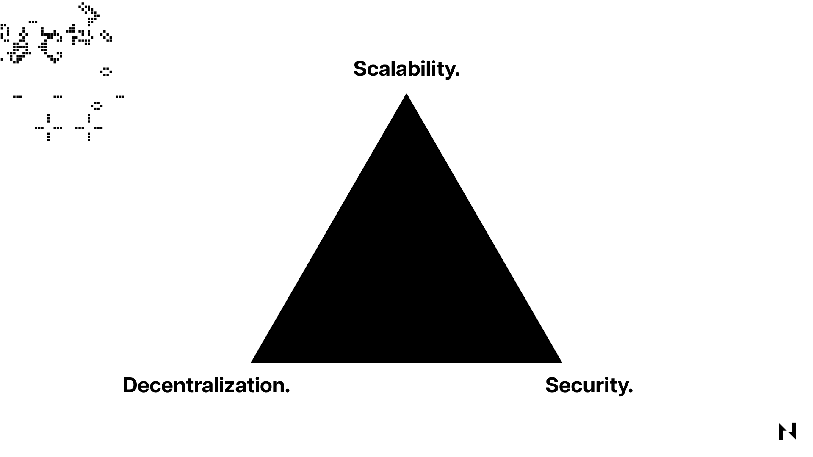
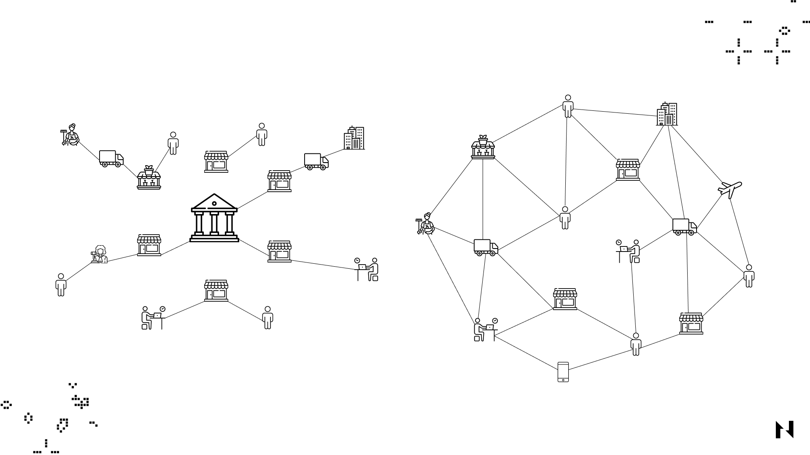
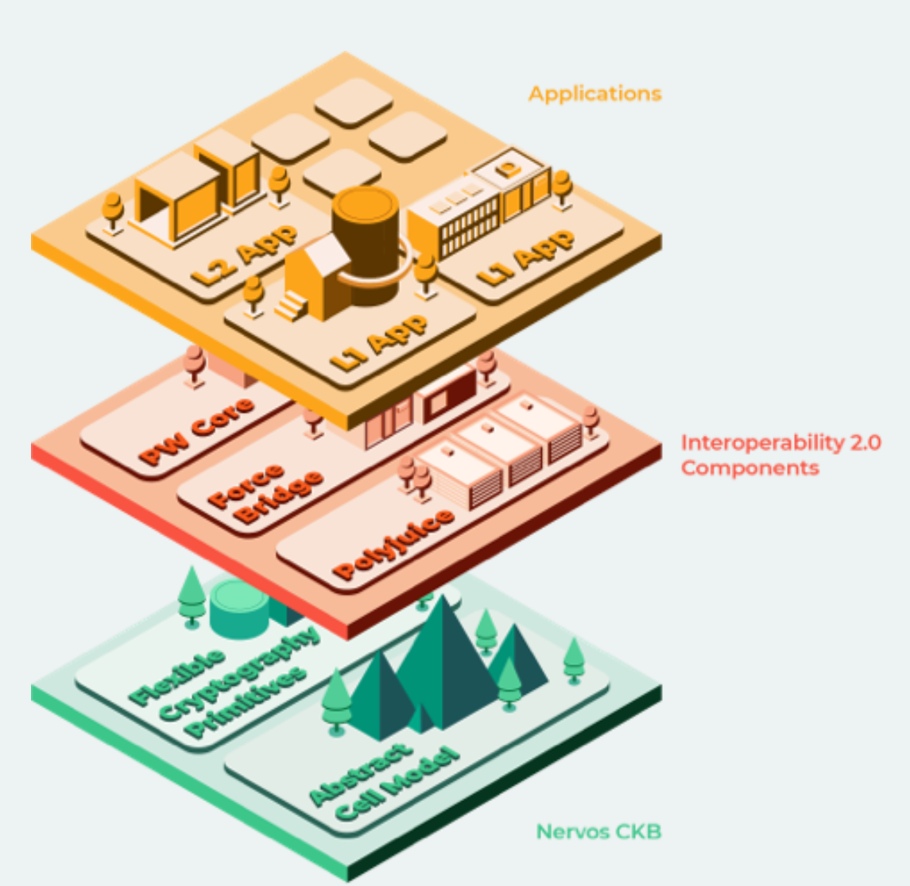

### What is the Blockchain Trilemma?

The Blockchain Trilemma is a theory, proposed by Ethereum founder Vitalik Buterin, stating that blockchain networks can’t be secure, decentralized, and scalable all at the same time.

This trilemma arises because increasing a blockchain's transaction processing speed and capacity typically requires more computing power and network bandwidth, making it more expensive and difficult for nodes to operate. This can lead to fewer nodes on the network, making it more centralized and potentially compromising its security and decentralization.

Therefore, the trilemma highlights the trade-offs that all blockchains encounter when trying to scale and the challenges of achieving a truly decentralized and scalable blockchain.

## Decentralization in Blockchain

Decentralization is a critical aspect of blockchains because it ensures that the network is not controlled by any single entity or group of entities. In a decentralized network, all participants have equal power to validate and verify transactions, making the network more resistant to attacks, capture, and censorship.

_The comparison between centralized network (left) vs. decentralized network (right)._

Because decentralized blockchains have no single points of failure, they're significantly harder to attack and compromise than centralized systems. By eliminating the need for intermediaries or trusted third parties, blockchains sacrifice efficiency for security and other qualities like censorship resistance and permisionlessness. In other words, sufficient decentralization makes it impossible for the network’s participants to collude and tamper with or compromise the blockchain. 

## Security in Blockchain

Blockchain security is directly and proportionally tied to decentralization. The more decentralized a blockchain is, the more secure it becomes.

Security in this context refers to the blockchain’s ability to resist different types of attacks without experiencing any downtime. In Proof-of-Work blockchains, security is typically measured by the network’s cumulative hash rate, where a higher and more equally distributed hash rate implies greater security. On the other hand, the security of Proof-of-Stake-based blockchains is typically measured (among other thighs) by the cumulative staked amount and its distribution. 

For example, suppose a single miner or a validator controls more than half of a network’s hash rate or staked amount. In that case, they can relatively easily compromise the blockchain by executing a [51% attack](https://docs.google.com/document/d/115KQEYxFwQw9yKlcdpxVTQh7aEdju3PHUp_98nIxjFY/edit?usp=sharing) or attempting to censor transactions.

Another essential security feature of blockchains is the underlying cryptography used to secure them. Every blockchain network utilizes cryptographic functions to encrypt and secure data. If the underlying cryptographic primitives or encryption mechanisms are easy to break, so will the blockchain. For example, Bitcoin heavily relies on the SHA256 hashing algorithm for its encryption. If one day someone manages to break this algorithm, either by finding its key or brute forcing the algorithm using a quantum computer, then Bitcoin’s security will be destroyed.

## Scalability in Blockchain

Scalability, in the context of blockchains, refers to the ability of a blockchain network to handle a growing volume of transactions while maintaining reasonable transaction processing times and costs. The more scalable a blockchain is, the better equipped it is to accommodate higher transaction throughput without compromising decentralization or security.

There are several approaches to scaling blockchains, each with its own trade-offs. For instance, on-chain scaling involves either increasing the block size, decreasing the block time, or both. Larger blocks can accommodate more transactions, while shorter block times allow for quicker confirmation of transactions. However, increasing the block size and decreasing the block time can result in a more centralized network, as these changes may require more powerful hardware to validate and propagate blocks, potentially excluding some nodes from participating in the consensus process.

To scale sensibly, blockchains must balance several factors, including security, decentralization, and performance. Increasing scalability often requires sacrificing one of these aspects. For example, larger blocks can increase throughput but lead to greater centralization, as fewer nodes have the resources to store and process the entire blockchain. This means that on-chain scaling is an inherently limited approach, which is why ever more blockchains are adopting off-chain scaling through layered architectures.

Off-chain scaling means moving some transactions off the main blockchain to secondary layers or sidechains. Examples of off-chain scaling solutions include Layer 2 networks like state channels and rollups, and sidechains with their own consensus mechanism and security properties. Off-chain scaling can significantly improve transaction throughput but may introduce additional complexity and potential security risks to the system.

Another less popular scaling solution is sharding, which involves splitting the blockchain into smaller, parallel chains called shards. Each shard processes a subset of the total transactions, thus increasing overall throughput. Sharding can be complex to implement and may introduce new attack vectors.

## Finding Solutions to the Blockchain Trilemma

There are different proposals to solve the blockchain trilemma. For example, some newer blockchain projects utilize modified versions of the Proof-of-Stake consensus mechanism, like Delegated Proof-of-Stake or Proof-of-Authority, where they sacrifice a certain amount of decentralization to improve scalability. 

For example, instead of allowing unlimited nodes to validate transactions, they limit the number of nodes to only 100 or fewer. These nodes can run much more powerful and expensive hardware, expanding the network's processing power, but also increasing the network's dependency on a small set of validators that can be more easily attacked and compromised.

Other popular solutions include the previously mentioned Layer 2 networks like state channels and rollups. These solutions allow blockchains to offload a significant portion of the transaction processing to separate networks built on top of them. Since Layer 2 networks are fully dependent on the underlying Layer 1 blockchain for their security and decentralization, they're often seen as one of the most promising solutions to the Blockchain Trilemma.

Read the detailed explanation on [Layer 1 vs. Layer 2](https://docs.google.com/document/u/3/d/152fZsM4iez33AYC6Xczvg0vGfhPfVQWE09nKZhek-X4/edit?usp=sharing) to understand how both of them work.

## How Nervos Solved the Blockchain Trilemma

_Nervos’ multi-layer model illustrated_

Nervos utilizes a multi-layer blockchain model. Nervos Layer 1 blockchain, called the [Common Knowledge Base](https://medium.com/nervosnetwork/nervos-ckb-in-a-nutshell-7a4ac8f99e0e), utilizes the Proof-of-Work consensus mechanism, which remains the most battle-tested consensus mechanism when it comes to decentralization and blockchain security. Meanwhile, there are two Nervos Layer 2 blockchains; they are called AXON and [Godwoken](https://godwoken.com), where AXON is a sidechain and Godwoken is an Optimistic Rollup. Both AXON and Godwoken utilize Common Knowledge Base for their security and decentralization.

By using a multi-layer model like this, the idea is to improve scalability in the Nervos ecosystem while still able to maintain a good level of blockchain decentralization and security.

Read more about [how Nervos multi-layer model is designed from the ground up to solve blockchain trilemma](https://medium.com/nervosnetwork/how-to-move-beyond-blockchains-trilemma-6a10ae034e9f)**.**